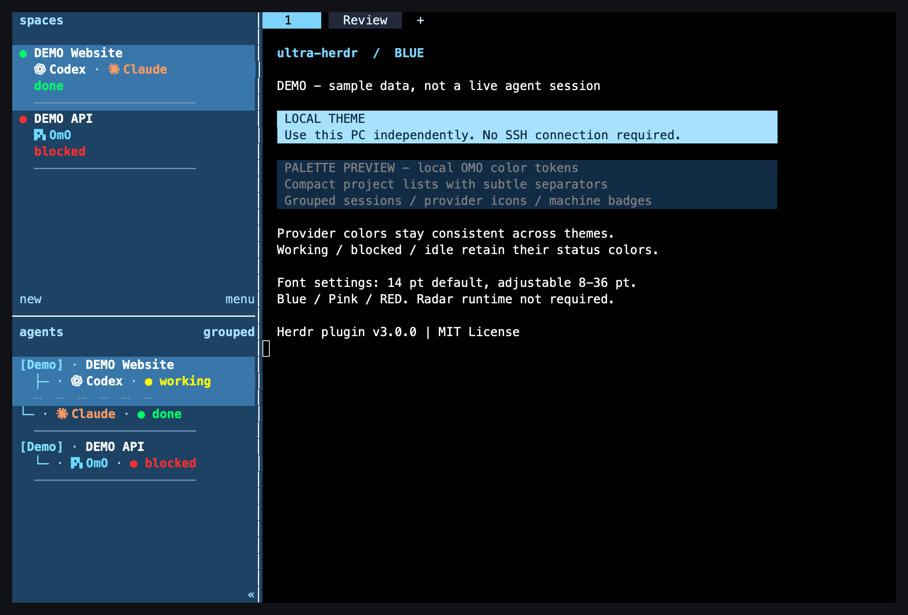
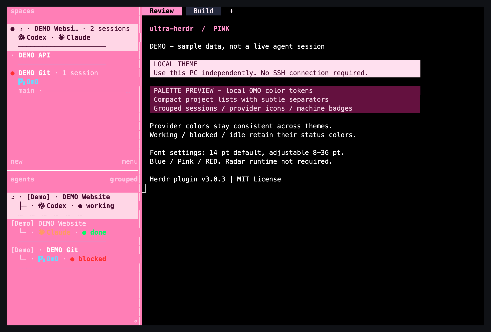
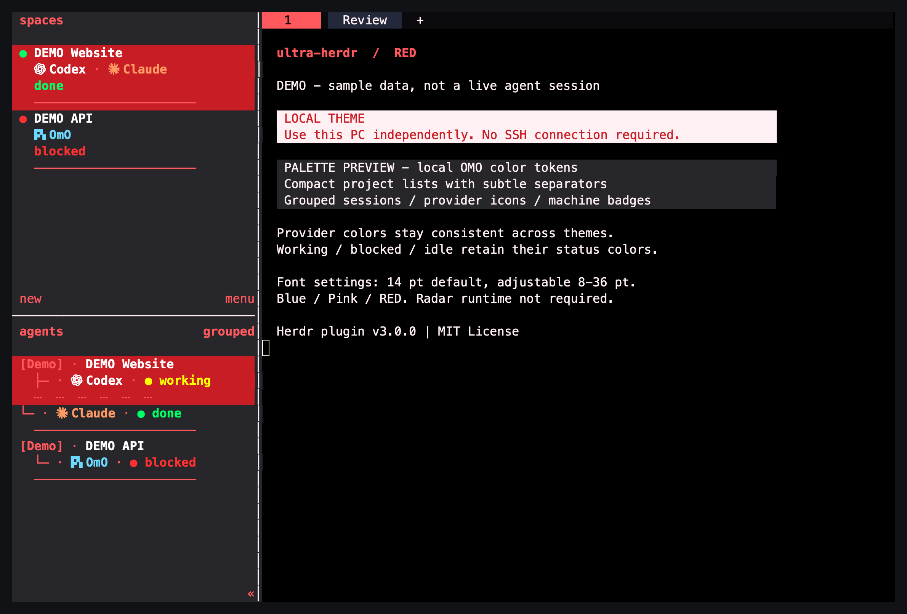

# ultra-herdr

**Herdr plugin v3.0.19 — PC별 Blue / Pink / RED 작업공간 테마와 목록 개선 플러그인**

`ultra-herdr`는 Herdr 0.9.1용 **로컬 전용** 플러그인입니다. 설치한 그 PC의 Herdr
설정, 전용 터미널 글꼴 크기, OMO 사용자 테마만 바꿉니다. 복제 경로는 자유이며,
PC 구성이나 네트워크 토폴로지를 가정하지 않습니다.

> [!IMPORTANT]
> **각 설치는 자기 호스트만 변경합니다.** 이 플러그인에는 대상 PC 선택기, SSH
> 별칭, 원격 동기화, 다른 PC의 공유 테마 파일 쓰기가 없습니다. `targets.mjs`와
> `client-apply.mjs`도 v3에는 없습니다.

Repository: <https://github.com/toughCSB/ultra-herdr>

## 플러그인 매니저 설치와 업데이트

플러그인 매니저에서 `toughCSB/ultra-herdr`를 설치하거나 업데이트하세요.
CLI로 같은 GitHub source를 설치할 수도 있습니다.

```sh
herdr plugin install toughCSB/ultra-herdr --yes
```

로컬 링크로 설치한 경우에는 먼저 `herdr plugin unlink local.ultra-herdr`를 실행한 뒤
위 명령으로 GitHub source로 전환해야 매니저에서 업데이트할 수 있습니다.
연결 해제는 저장 설정을 삭제하지 않으며 플러그인 ID는 `local.ultra-herdr`로 유지됩니다.
설치 단계에서 release의 companion client를 SHA256 검증 후 별도 폴더에 설치하고
Herdr 전용 launcher만 갱신합니다. 지원 binary는 macOS Apple Silicon과 Windows x64입니다.
업데이트 후 **Herdr client 창만 다시 여세요**. 기존 서버나 agent 대화는 종료하지 않습니다.

v3.0.15는 sidebar를 보는 PC의 테마로 유지하고, terminal 기본색은 실행 PC의
metadata로 전달합니다. RED 사용자 대화창은 밝은 빨강 `#ffb3b8` / 진한 글자
`#650d18`, 코드블럭은 옅은 보라 `#e9ddff` / 진한 글자 `#302044`입니다.
Blue 코드블럭은 진한 파랑 `#123b70` / 밝은 글자 `#e1efff`로 표시합니다.
이 색상은 플러그인 `themes.mjs`에서 제어하며, 각 pane을 실행하는 PC의 workspace
metadata를 사용합니다. Pink 설정과 sidebar의 로컬 PC 기준은 유지됩니다.

Companion client가 Codex/Claude의 제출된 사용자 메시지를 구분하고,
Codex/Claude/OMO의 코드 fence 또는 들여쓴 구문 강조 행을 색칠합니다.
일반 텍스트만으로 출력된 경계 없는 코드는 오인식을 피하려고 추측하지 않습니다.
코드 글자의 대비, 원래 문자열·링크·한글 폭, diff 배경과 입력 중인 프롬프트를
보존합니다. 부분 업데이트도 전체 frame과 같은 처리를 거쳐 스크롤 색상 잔상을
방지합니다. OMO 사용자 메시지 팔레트 역시 동일한 플러그인 설정을 사용합니다.

v3.0.16은 한글·CJK 메시지의 두 번째 문자 칸이 부분 업데이트에서 초기화될 때
대화창이 회색으로 돌아가는 문제를 수정합니다. 원본 문자 폭을 기준으로 보이지 않는
보조 칸을 제외하고 메시지를 인식하며, 명시적인 대화창 배경의 빈 여백도 함께 적용합니다.
Mac 실행 경로는 `ultra-herdr-client/current/herdr`로 고정해 이후 새 창에서 구버전
경로가 재사용되지 않도록 합니다. 최초 전환 후 기존 클라이언트 창은 다시 열어야 합니다.

v3.0.17은 Pink의 새 탭 입력란, 초기화/취소 버튼, 비활성 탭이 어두운 기본 배경을
물려받던 문제를 수정합니다. `surface0=#f5dce8`, `surface1=#fbe8f1`로 밝은 로즈
배경을 사용하고 진한 글자와의 대비를 4.5:1 이상 확보합니다. 선택된 탭과 저장
버튼은 진한 핑크와 밝은 글자입니다. Blue/RED로 전환하면 기존 어두운 배경으로
복원됩니다.

v3.0.18은 파일 sidebar의 Markdown preview와 standalone Glow의 밝기를 실행 PC
테마에 맞춥니다. Blue/RED의 어두운 본문에도 4.5:1 이상 대비 보정을 적용하며
이미 읽을 수 있는 색상, 원본 글자·링크·대화/코드 배경은 보존합니다. Windows의
새 로컬 PowerShell에서 `herdr` 또는 `herdr --session 이름`을 실행하면 동일한
companion client가 열립니다. API/server/bridge/update 명령과 SSH는 공식 실행
경로를 유지합니다. 사용자 PowerShell profile은 백업 후 관리 블록만 추가합니다.
이미 열린 PowerShell은 새 창을 열어야 이 실행 경로가 반영됩니다.

v3.0.19는 세 테마의 사이드바 상태를 서로 다른 아이콘·배지·행 배경으로 구분합니다.
Idle은 회색 `○`, Working은 노랑/주황 `◔`, Blocked는 빨강 `!`, Done은
에메랄드 `✓`, Unknown은 중립색 `?`입니다. 선택한 항목은 기존 테마의 선택 배경과
`›` 표시를 사용하며 상태 배지는 그대로 유지합니다. Done은 새 답변 확인 대기이며,
답변을 확인하면 기존 Herdr 동작대로 Idle로 바뀝니다. sidebar 글자는 실제 배경에
대해 4.5:1 이상 대비를 확보하고, provider 로고의 고유색은 보존합니다. 설정 적용 시
보는 PC의 Herdr 설정 폴더에 `plugins/config/local.ultra-herdr/sidebar-status.json`을
관리하며, terminal 본문·대화·코드 색상은 기존 실행 PC 기준을 유지합니다.

## 제공 기능

- **촘촘하고 구분된 목록:** 불필요한 빈 행을 없애고, 프로젝트 경계에는 얇은 실선,
  같은 workspace의 세션 사이에는 짧은 점선과 트리 행을 사용합니다.
- **workspace별 그룹:** 경로나 표시 이름이 아니라 Herdr `workspace_id` 기준으로
  같은 workspace의 세션을 한 제목 아래에 묶습니다. `grouped` 정렬을 사용하세요.
  하위 세션의 꺾쇠는 같은 열에 정렬됩니다. 후속 세션에도 소속을 보통 굵기로 남겨
  `Priority` 정렬에서 순서가 바뀌어도 머신·프로젝트를 확인할 수 있습니다.
  테마 적용은 설정 파일에 저장된 정렬 선택을 보존합니다.
- **머신·프로바이더 표식:** agents 패널에는 머신 배지를, agents와 machines(또는
  spaces) 양쪽 패널에는 프로바이더 이름·아이콘·고유 색을 표시합니다. 머신 그룹
  제목은 Herdr가 표시하며, 중복 프로바이더는 머신 패널에서 한 번만 보입니다.
- **다중 세션 개수:** machines/spaces 프로젝트 제목 옆의 `2 sessions`처럼
  감지된 agent 세션 수를 표시합니다. 같은 프로바이더의 여러 세션도 각각 셉니다.
  빈 터미널 탭 수와는 다르며, 세션 제목은 agents 목록에서 확인합니다.
  machines의 상태 배지는 프로젝트 제목과 같은 행에 표시하고 branch/git 정보를
  구분선 행에 합쳐 목록을 촘촘하게 유지합니다.
- **상태를 꾸미지 않음:** `working`, `blocked`, `idle`/`done`, `unknown`은 실제
  Herdr/agent 상태입니다. 실행 중인 항목을 가짜 `Working`으로 고정하지 않습니다.
- **Working 스피너:** 실제 Working 세션과 해당 프로젝트에만 작은 회전 표시를
  추가합니다. Herdr 시작 훅의 라벨러가 로컬 IPC로 현재 상태를 읽으며, 프레임마다
  CLI 프로세스를 실행하지 않습니다. 작업 종료 시 표시를 지우고, 라벨러가 비정상
  종료되더라도 activity metadata는 2초 뒤 만료됩니다. 상태별 고정 아이콘과
  회전하는 activity 표시는 함께 사용합니다.
- **Radar 런타임 없음:** 독립 아이콘 글꼴과 글리프 매핑만 사용합니다. Radar 플러그인,
  정렬기, 상태 애니메이터, 백그라운드 런타임은 필요하지 않습니다.
- **전체 창 글꼴 크기:** 기본 `14pt`, 허용 범위 `8–36pt`이며 Herdr 전용 창의
  전체 폰트를 조절합니다.
- **Blue / Pink / RED:** Pink는 선명한 핑크 강조색을 사용하고, RED는
  Satin Poppy Black Red 계열(`#0B0B0E`, `#26262B`, `#C81D25`, `#FF595E`,
  `#FFF0F3`)을 사용합니다.
- **OMO 본문 팔레트:** Pink는 밝은 핑크 메시지·도구 상자와 진한 핑크 강조색을
  적용합니다. Blue/RED의 기존 연동 동작은 유지됩니다.

상태색은 테마와 별도 정보입니다. Pink의 Working 배지는 진한 주황 `#914600`,
Blue/RED는 밝은 노랑 `#fcd34d`입니다. Blocked는 빨강, Done은 에메랄드,
Idle과 Unknown은 중립색으로 표시하며 서로 다른 아이콘을 사용합니다.
Pink provider icon/name은 저장된
Radar 브랜드 팔레트로 표시하고, Blue/RED는 기존 provider 색을 사용합니다.

Pink는 참고 화면의 사이드바 `#ffebea`, 선택 배경 `#febab9`를 사용합니다.
메인 terminal과 OMO 본문에도 해당 실행 PC의 Pink 설정을 적용합니다. 사이드바 글자는 진한 색으로
표시하고 상태 아이콘은 세 테마에서 동일한 모양으로 구분합니다. Working 활동 표시도
주황색입니다. Codex, OpenCode 및 알 수 없는 provider의 기본색은 진한 잉크,
알려진 provider는 기존 Radar 팔레트의 고유색을 사용합니다. 상태 묶음을
provider 앞에 배치합니다. 전체
sidebar chrome 글자 처리에는
[Herdr 0.9.1 클라이언트 패치](client-patches/README.md)를 사용합니다.

```text
[MyPC] · 웹 프로젝트
  ├─ ◔ WORKING · Codex
  ·················
  └─ ✓ DONE · OMO
  ──────────────────
[MyPC] · 문서 프로젝트
  └─ ! BLOCKED · Claude
```

## 스크린샷

아래는 실제 Herdr 터미널 출력을 렌더링한 **합성 `DEMO` 데이터**입니다. 개인 사용자명,
프로젝트 경로, 실제 agent 런타임 결과를 포함하지 않으며, agent가 실제로 실행됐다는
증거도 아닙니다.
이전 버전의 데모 캡처이며 v3.0.14의 본문 팔레트와 스크롤 수정 검증 화면은 아닙니다.

| Blue | Pink | RED |
|---|---|---|
|  |  |  |

캡처 방식: 격리된 Herdr 0.9.1 세션의 120×36 PTY 출력을 xterm.js로 렌더링했습니다.
오른쪽 박스는 실제 OMO 팔레트 토큰을 사용하는 예시 출력이며, 실제 OMO 대화가 아닙니다.
스크린샷은 클릭하면 원본 크기로 볼 수 있습니다.

## 지원 범위

| 항목 | 범위 |
|---|---|
| Herdr | **0.9.1**에서 테스트 |
| Node.js | **24 이상** |
| npm 의존성 | 없음 |
| 플랫폼 | macOS, Windows |
| 아이콘 글꼴 | `assets/fonts/HerdrAgentIconsMax.ttf` |
| 선택 사항 | [OMO 상태 reporter](integrations/omo/README.md), OMO 5.0.0-beta.90 대상 |

Linux, 다른 macOS 터미널, Windows Terminal Preview/포터블 배포는 검증 범위가
아닙니다. 이 플러그인은 Auto Title이나 Plugin Manager를 설치하지 않습니다.

## 설치

### 1. 원하는 위치에 복제

저장소 경로는 임의로 정할 수 있습니다. 다음의 `$HOME/src/ultra-herdr`는 예시일 뿐,
특정 PC 이름·공유 폴더·SSH 구성을 뜻하지 않습니다.

```sh
git clone https://github.com/toughCSB/ultra-herdr.git "$HOME/src/ultra-herdr"
cd "$HOME/src/ultra-herdr"
```

Windows PowerShell도 같은 원칙입니다.

```powershell
git clone https://github.com/toughCSB/ultra-herdr.git "$HOME\src\ultra-herdr"
Set-Location "$HOME\src\ultra-herdr"
```

`npm install`은 하지 마세요. 이 저장소는 외부 의존성이 없습니다.

### 2. 아이콘과 Herdr 전용 터미널 설정

`assets/fonts/HerdrAgentIconsMax.ttf`를 **사용자 글꼴**로 설치합니다. 이것은
아이콘 전용 글꼴입니다. 본문은 별도 글꼴을 사용하며, 예시는 `Jetendard`입니다.
새 아이콘 글꼴이 보이지 않으면 터미널 클라이언트만 다시 여세요.

macOS Ghostty 예시는
[`examples/herdr.ghostty.example`](examples/herdr.ghostty.example)입니다. 이를
`~/.local/share/herdr-launcher/herdr.ghostty`에 복사한 뒤 다음을 모두 확인합니다.

- `title = Herdr`를 유지합니다.
- `command = direct:` 뒤에는 `command -v herdr`가 출력한 **실제 절대 실행 파일
  경로**를 넣습니다. 예: `command = direct:/opt/homebrew/bin/herdr`
- 아이콘 코드포인트 맵과 본문 글꼴은 예시를 그대로 시작점으로 사용합니다.

```sh
ghostty +validate-config --config-file="$HOME/.local/share/herdr-launcher/herdr.ghostty"
```

Windows에서는 Herdr 프로필만 사용하세요. 일반 PowerShell 프로필이나 다른
Windows Terminal 프로필의 크기를 바꾸지 않습니다. 창 제목 문자열만 `Herdr`인 것은
Herdr 프로필을 사용한다는 뜻이 아닙니다.

### 3. 로컬 플러그인 설정

먼저 플랫폼의 플러그인 설정 디렉터리를 백업합니다.

| OS | 기본 설정 파일 |
|---|---|
| macOS | `~/.config/herdr/plugins/config/local.ultra-herdr/settings.json` |
| Windows | `%APPDATA%\herdr\plugins\config\local.ultra-herdr\settings.json` |

`HERDR_PLUGIN_CONFIG_DIR`가 있으면 Herdr가 제공한 그 경로가 우선입니다.
[`examples/settings.local.example.json`](examples/settings.local.example.json)을
위 위치의 `settings.json`으로 복사해 시작하세요.

```json
{
  "localMachineLabel": "MyPC",
  "fontSize": 14,
  "theme": "blue"
}
```

`localMachineLabel`을 생략하면 호스트명이 기본값입니다. `"MyPC"`처럼 임의의
레이블도 지원하며, 네트워크 이름이나 SSH alias일 필요가 없습니다.
`fontSize`는 `8–36`, `theme`는 `blue`, `pink`, `red`입니다.

### 4. Herdr 설정의 새 설치 시드

기존 설정 파일을 덮어쓰지 말고 먼저 백업하세요. 새 Herdr 설치에만
[`examples/herdr-config.example.toml`](examples/herdr-config.example.toml)을
시드로 사용합니다. 기존 설정에는 필요한 `[theme]`, `[theme.custom]`, sidebar
관리 마커만 통합하고, 중복 테이블을 만들지 마세요.

```toml
# >>> ultra-herdr sidebar
# 이 사이의 Herdr sidebar 행만 플러그인이 관리합니다.
# <<< ultra-herdr sidebar
```

잘못된 TOML은 `herdr config check`로 확인할 수 있습니다. 마커가 없으면 테마는
적용되어도 플러그인이 sidebar 행을 삽입하지 않습니다.

### 5. 링크와 최초 적용

복제한 저장소 루트에서 실행합니다.

```sh
herdr plugin link . --enabled
herdr plugin action invoke local.ultra-herdr.apply
```

기본 Blue, `14pt`, 로컬 머신 배지가 적용됐는지 이 PC의 Herdr 창에서 확인하세요.

## 사용법과 원격 workspace 경계

### 현재 PC를 바꾸는 방법

v3에는 **대상 PC 선택 UI가 없습니다.** 현재 PC의 테마/글꼴을 바꾸려면 다음 중
하나를 사용합니다.

1. Herdr에서 **Local** workspace를 선택하고 플러그인 action을 실행합니다.
2. 그 PC의 저장소 루트에서 로컬 launcher를 실행합니다.

```sh
# macOS
./local-settings.command
```

```bat
:: Windows cmd.exe
local-settings.cmd
```

두 launcher는 저장소 루트의 `settings.mjs`를 실행합니다. SSH를 열거나 다른
호스트에 쓰지 않습니다.

Windows에서는 다음 명령으로 바탕화면에 **ultra-herdr Local Settings** 바로가기를
만들 수 있습니다. 이후 이 바로가기를 사용하면 Herdr에서 어떤 원격 프로젝트를
보고 있든 **바로가기를 누른 PC**의 설정이 열립니다.

```powershell
powershell.exe -NoProfile -ExecutionPolicy Bypass -File .\create-local-shortcut.ps1
```

플러그인 메뉴의 **[세션 실행 PC]**는 이 로컬 바로가기와 다릅니다. 예를 들어 HOME에서
Mac 세션을 선택해 그 메뉴를 열면 Mac 설정이 열리므로, Mac의 OMO 내용색만 바뀌고
HOME 사이드바는 유지될 수 있습니다. 팝업의 **설정 대상 PC**를 확인하세요.

### Herdr 0.9.1에서 반드시 알아야 할 점

원격 workspace에서 실행한 Herdr plugin action은 **viewer PC가 아니라 원격
workspace의 HOST에서 실행**됩니다. 원격 workspace를 보고 있을 때 테마 action을
누르면 그 원격 HOST의 로컬 설치가 바뀌는 것이며, viewer 쪽에서 투명하게 실행되는
것이 아닙니다.

따라서 현재 PC를 바꾸려면 위의 Local workspace 또는 로컬 launcher를 사용하세요.
원격 화면의 agent ANSI 색은 원격 HOST가 생성합니다. 플러그인은 설치 호스트의 Herdr chrome과 OMO 테마를 설정하고, companion client는
원격 workspace가 전달한 색상으로 메시지·코드블럭을 표시합니다. 원본 PTY 데이터는 변경하지 않습니다.

Herdr에는 public local-client-only reload API나 `config.toml` 자동 감시가 없습니다.
따라서 이 플러그인은 remote workspace를 보고 있을 때 viewer의 chrome을 자동
새로고침하지 않습니다. 수동으로 갱신하려면 먼저 플러그인 popup을 닫으세요. popup이
열려 있으면 prefix 키를 가로채므로 reload 단축키는 동작하지 않습니다. popup을 닫은
뒤 Herdr 메뉴의 **Reload config**를 사용하거나, 설정한 경우에만 `prefix` +
`Shift+R`을 사용합니다(기본 prefix: `Ctrl+B`, 즉 `Ctrl+B` 후 `Shift+R`).

이 수동 Herdr reload는 로컬 client 설정을 다시 읽고 활성 endpoint server도
reload합니다. 그러나 이 플러그인이 원격 설정 파일을 쓰거나, 원격 action이 viewer
PC에서 실행되도록 바꾸지는 않습니다. local-server 연결이 없는 client는 다시 열어야
할 수 있습니다. 외부 서버나 SSH 연결은 필요하지 않으며, Herdr 자체의 로컬 프로세스는
목록 표시와 설정 reload를 위해 사용합니다.

### 테마와 글꼴

Plugin Manager 또는 CLI에서 로컬 action을 실행합니다.

```sh
herdr plugin action invoke local.ultra-herdr.settings
herdr plugin action invoke local.ultra-herdr.blue
herdr plugin action invoke local.ultra-herdr.pink
herdr plugin action invoke local.ultra-herdr.red
```

`settings`는 현재 HOST의 설정만 변경합니다. 빈 입력은 현재 값을 유지하고 `q`는
쓰기 없이 취소합니다. 글꼴 크기는 Herdr 전용 창 전체에 적용되며, 설정 파일 숫자만
보지 말고 실제 창에서 `14 → 18 → 14pt`처럼 확인하세요.

## 선택 사항: OMO 상태 reporter

[`integrations/omo/README.md`](integrations/omo/README.md)는 별도 설치하는
OMO 5.0.0-beta.90 reporter를 설명합니다. 이것은 OMO/Senpi 상태를 Herdr에 더
정확히 보고하기 위한 선택 기능이며, 테마 플러그인의 필수 구성요소가 아닙니다.

reporter는 실제 turn, blocked, children, monitor, settled, quit 이벤트를 사용해
`custom:senpi` / agent `omo`를 보고합니다. 가짜 `working` 고정이나 화면 문자열
폴링은 하지 않습니다. native Pi 세션으로 위장하지 않으므로 Pi resume 또는
`agent explain` 지원을 약속하지 않으며, 실행 중인 세션의 내부를 침습적으로
검사하라고 안내하지 않습니다.

## 검증

Node 24와 npm만 있으면 됩니다.

```sh
npm test
npm run check
```

테스트 수는 계속 바뀔 수 있으므로 README에 고정 개수를 적지 않습니다. 일반 테스트는
실제 Herdr/OMO 설정이나 터미널 창을 변경하지 않습니다. 설치 후에는 실제 로컬 Herdr
창에서 다음을 확인하세요.

1. agents와 machines/spaces 양쪽 패널에 머신 배지와 프로바이더 아이콘·색이 보인다.
2. 같은 `workspace_id` 세션이 함께 묶이고, 구분선과 간격이 읽기 좋다.
3. Blue, Pink, RED 및 로컬 OMO 메시지·도구 박스가 바뀐다.
4. `working`/`blocked`가 실제 상태와 맞고 `unknown`을 임의로 숨기지 않는다.
5. 로컬 action은 로컬만 바꾸며 원격 pane은 실행 PC의 메시지·코드블럭 색상을 사용한다.

## 업데이트, 제거, 복구

업데이트 전 다음을 백업합니다.

- Herdr 설정과 `local.ultra-herdr/settings.json`
- Herdr 전용 Ghostty 또는 Windows Terminal `Herdr` 프로필
- OMO 사용자 테마와, 설치했다면 OMO reporter 파일

복제본에서 변경 사항을 확인한 뒤 fast-forward 업데이트를 적용합니다.

```sh
git status
git pull --ff-only
npm test
npm run check
herdr plugin link . --enabled
```

제거는 먼저 링크를 해제한 뒤 필요하면 복제본과 선택적 OMO reporter를 제거합니다.

```sh
herdr plugin unlink local.ultra-herdr
```

링크 해제나 파일 삭제는 이전 테마, 글꼴 크기, OMO 테마를 자동 복원하지 않습니다.
백업본을 복원한 뒤 Herdr 설정을 다시 읽히세요. 아이콘 글꼴은 다른 프로그램이
사용하지 않는지 확인한 뒤 운영체제 글꼴 관리에서 제거합니다.

## 라이선스와 고지

저장소는 MIT 라이선스를 따릅니다. 아이콘 글꼴·글리프 출처와 제3자 상표/라이선스
고지는 [`THIRD_PARTY_NOTICES.md`](THIRD_PARTY_NOTICES.md)를 따릅니다.
